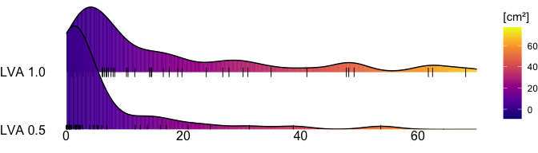
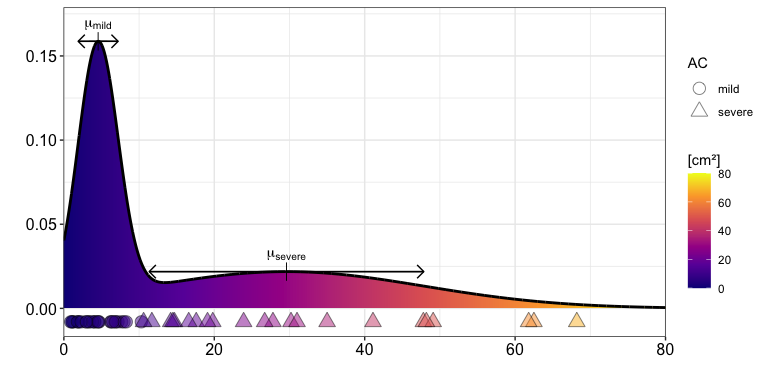
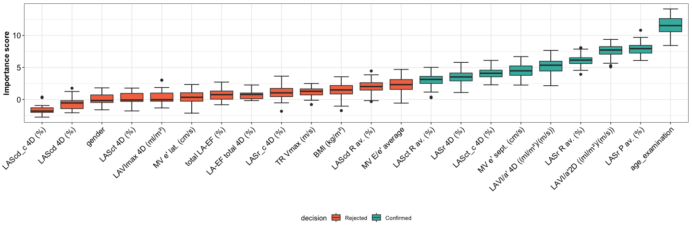
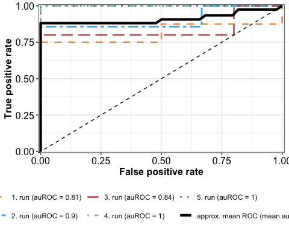
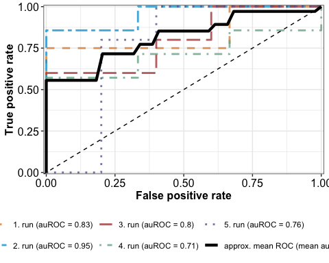
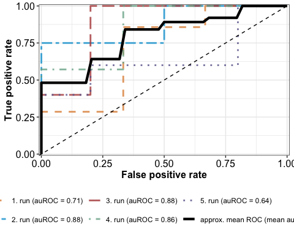
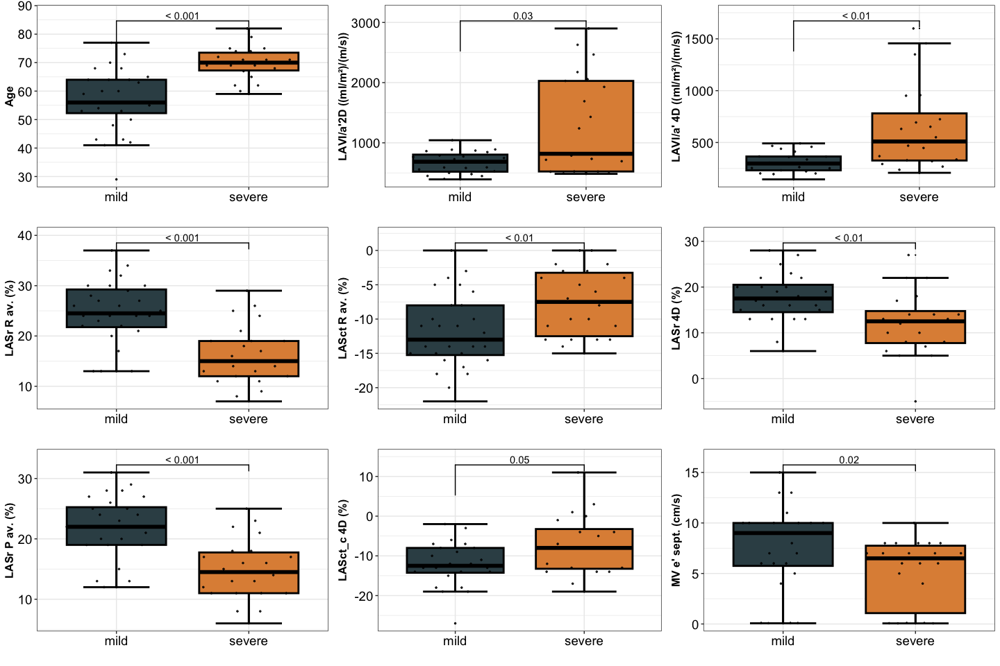
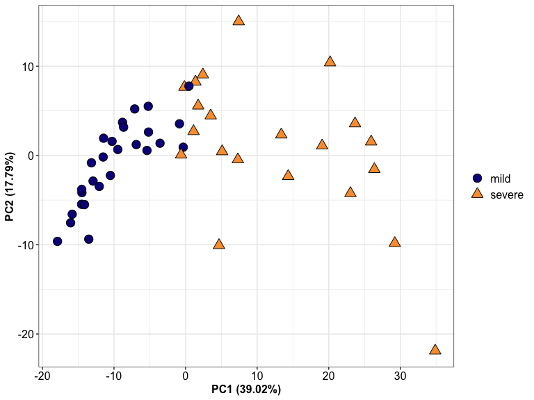
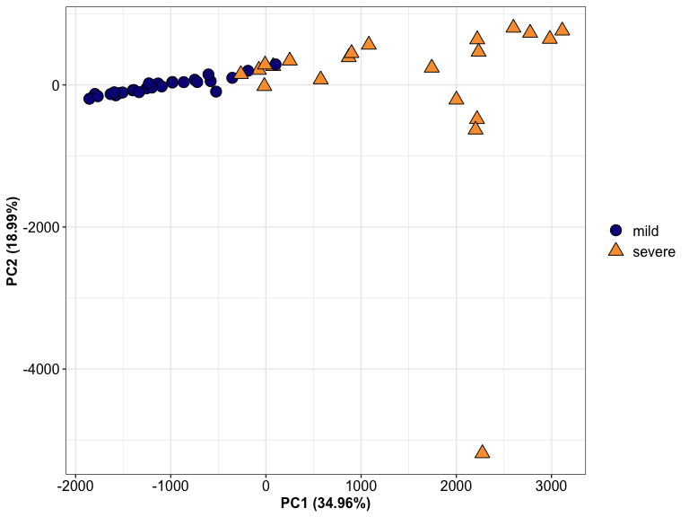

Noninvasive prediction of atrial cardiomyopathy characterized by multipolar high-density contact mapping
================

Moritz T. Huttelmaier MD<sup>a</sup>; Alexander Gabel, PhD
<sup>b,c</sup>; Stefan Störk, MD PhD <sup>a,d</sup>; Stefan Frantz, MD
<sup>a,d</sup>; Caroline Morbach, MD <sup>a,d</sup>; Thomas H. Fischer,
MD <sup>a</sup\>

<sup>a</sup> Dept. of Internal Medicine I, University Hospital Würzburg
(UKW), Germany

<sup>b</sup> Institute of Medical Virology, Goethe-University Frankfurt,
60596 Frankfurt am Main, Germany

<sup>c</sup> Infection Control and Antimicrobial Stewardship Unit, UKW,
Würzburg, Germany

<sup>d</sup> Dept. Clinical Research & Epidemiology, Comprehensive Heart
Failure Centre Würzburg, University Hospital Würzburg, Germany

<br />

Content
========

- [Import Data](#import-data)
- [General Stats](#general-stats)
  - [Gender](#gender)
  - [Median (IQR)](#median-iqr)
  - [Mean ± SD](#mean--sd)
  - [Paroxysomal AF bzw. Persistent
    AF](#paroxysomal-af-bzw-persistent-af)
- [Gaussian Mixture Model (GMM)](#gaussian-mixture-model-gmm)
  - [GMM - LVA 0.5 (cm²)](#gmm---lva-05-cm²)
  - [GMM - LVA 1.0 (cm²)](#gmm---lva-10-cm²)
  - [Summarizing GMM experiments (Two
    classes)](#summarizing-gmm-experiments-two-classes)
  - [Proof of concept](#proof-of-concept)
- [Echocardiography-dependent
  classification](#echocardiography-dependent-classification)
  - [Feature-Selection (Boruta
    Algorithm)](#feature-selection-boruta-algorithm)
  - [Feature importance](#feature-importance)
- [SVM - classification](#svm---classification)
  - [SVM with linear kernel](#svm-with-linear-kernel)
  - [SVM with radial kernel](#svm-with-radial-kernel)
  - [SVM with polynomial kernel](#svm-with-polynomial-kernel)
  - [Pairwise comparison of severe and mild
    AC](#pairwise-comparison-of-severe-and-mild-ac)
- [Distribution of voltage values](#distribution-of-voltage-values)
  - [Area Ratio](#pca-area-ratio)
  - [Area\[mm^2\]](#areamm2)
- [Validation outcome after PVI](#validation-outcome-after-pvi)
  - [Recurrence AF ECG ≤ 12 months](#recurrence-af-ecg--12-months)
  - [Recurrence AF ECG FU](#recurrence-af-ecg-fu)
  - [Recurrence AF symptoms +/- ECG
    FU](#recurrence-af-symptoms---ecg-fu)
  - [Recurrence AF symptoms +/- ECG ≤ 12
    months](#recurrence-af-symptoms---ecg--12-months)
- [Tables](#tables)
  - [Table 1](#table-1)
  - [Table 1a](#table-1a)
  - [Table 2](#table-2)
  - [Table 3](#table-3)
  - [Table 4](#table-4)


# Import Data

``` r
library(dplyr)
library(ggplot2)
library(dendextend)
library(Boruta)
library(Amelia)
library(caret)
library(yardstick)
library(plotly)
library(mclust)

source("R/helper_functions.R")

plot.dir <- "plots"

if(!file.exists(plot.dir)){
  dir.create(plot.dir)
}

data.dir <- "data"

if(!dir.exists(data.dir)){
  dir.create(data.dir)
}

compl_df <- readr::read_delim("data/input_dataset.csv", )

set.seed(1)
```

# General Stats

## Gender

``` r
compl_df %>% mutate(gender = if_else(`gender (0=female, 1=male)` == 0, 
                                     true = "female", false = "male")) %>% 
             group_by(gender) %>% summarise(n = n(), .groups = "drop") %>% 
             mutate(comb =  paste0(n, " (", round(n/sum(n) * 100, 2),"%)")) %>% 
             dplyr::select(-n) %>%
             tidyr::pivot_wider(names_from = gender, values_from = "comb") %>% 
  mutate(across(where(is.double), 
                ~ format(.x, digits = 2, scientific = T))) %>% 
  knitr::kable()
```

| female   | male     |
|:---------|:---------|
| 19 (38%) | 31 (62%) |

## Median (IQR)

``` r
compl_df %>% dplyr::summarise(Age = med_iqr(age_examination),
                       Height = med_iqr(`height (cm)`),
                       Weight = med_iqr(`weight (kg)`),
                       BMI = med_iqr(`BMI (kg/m²)`),
                       `NT_pro_BNP (pg/ml)` = med_iqr(`NT_pro_BNP (pg/ml)`),
                       `CHA2DS2-VASc` = med_iqr(`CHA2DS2-VASc`),
                        `AA_duration (months)` = med_iqr(`AA_duration (months)`),
                       `BSADuBois (m²)` = med_iqr(`BSADuBois (m²)`),
                       `LVEF biplan (%)` = med_iqr(`LVEF biplan (%)`),
                       `GLPS AFI average (%)` = med_iqr(`GLPS AFI average (%)`),
                       `Map Points` = med_iqr(map_points),
                       `LVA_0.5 (cm²)` = med_iqr(`LVA_0.5 (cm²)`),
                       `LVA_1.0 (cm²)` = med_iqr(`LVA_1.0 (cm²)`),
                       ) %>% 
              tidyr::pivot_longer(cols = matches("."), names_to = "Property", 
                                  values_to = "Median (IQR)") %>% 
              mutate(across(where(is.double), 
                            ~ format(.x, digits = 2, scientific = T))) %>% 
              knitr::kable()
```

| Property             | Median (IQR)           |
|:---------------------|:-----------------------|
| Age                  | 64 (56 - 70)           |
| Height               | 174.5 (168.2 - 180.8)  |
| Weight               | 85 (75 - 99.8)         |
| BMI                  | 28 (24.6 - 30.8)       |
| NT_pro_BNP (pg/ml)   | 189.5 (70.8 - 391.2)   |
| CHA2DS2-VASc         | 2 (1 - 3)              |
| AA_duration (months) | 0 (0 - 5)              |
| BSADuBois (m²)       | 2 (1.9 - 2.2)          |
| LVEF biplan (%)      | 61 (56.2 - 63)         |
| GLPS AFI average (%) | -17.6 (-18.9 - -16.2)  |
| Map Points           | 5711 (5217.2 - 6987.5) |
| LVA_0.5 (cm²)        | 1.8 (0.5 - 5.9)        |
| LVA_1.0 (cm²)        | 7.8 (3.9 - 22.9)       |

## Mean ± SD

``` r
compl_df %>% summarise(Age = mean_sd(age_examination),
                       Height = mean_sd(`height (cm)`),
                       Weight = mean_sd(`weight (kg)`),
                       BMI = mean_sd(`BMI (kg/m²)`),
                       `NT_pro_BNP (pg/ml)` = mean_sd(`NT_pro_BNP (pg/ml)`),
                       `CHA2DS2-VASc` = mean_sd(`CHA2DS2-VASc`),
                        `AA_duration (months)` = mean_sd(`AA_duration (months)`),
                       `BSADuBois (m²)` = mean_sd(`BSADuBois (m²)`),
                       `LVEF biplan (%)` = mean_sd(`LVEF biplan (%)`),
                       `GLPS AFI average (%)` = mean_sd(`GLPS AFI average (%)`),
                       `Map Points` = mean_sd(map_points),
                       `LVA_0.5 (cm²)` = mean_sd(`LVA_0.5 (cm²)`),
                       `LVA_1.0 (cm²)` = mean_sd(`LVA_1.0 (cm²)`),
                       ) %>% 
              tidyr::pivot_longer(cols = matches("."), 
                                  names_to = "Property", 
                                  values_to = "Mean ± SD") %>% 
              mutate(across(where(is.double), 
                            ~ format(.x, digits = 2, scientific = T))) %>% 
              knitr::kable()
```

| Property             | Mean ± SD         |
|:---------------------|:------------------|
| Age                  | 62.48 ± 11.01     |
| Height               | 175.12 ± 9.07     |
| Weight               | 87 ± 15.52        |
| BMI                  | 28.35 ± 4.52      |
| NT_pro_BNP (pg/ml)   | 292.28 ± 308.52   |
| CHA2DS2-VASc         | 2.28 ± 1.65       |
| AA_duration (months) | 2.24 ± 3.22       |
| BSADuBois (m²)       | 2.02 ± 0.2        |
| LVEF biplan (%)      | 60.4 ± 5.35       |
| GLPS AFI average (%) | -17.24 ± 2.59     |
| Map Points           | 6517.38 ± 2067.01 |
| LVA_0.5 (cm²)        | 6.32 ± 10.84      |
| LVA_1.0 (cm²)        | 16.34 ± 17.98     |

## Paroxysomal AF bzw. Persistent AF

``` r
compl_df %>% mutate(AF = if_else(`AF (0=paroxysmal, 1=persistent)` == 0, 
                                 true = "paroxysmal", false = "persistent")) %>% 
             group_by(AF) %>% summarise(n = n(), .groups = "drop") %>% 
             mutate(comb =  paste0(n, " (", round(n/sum(n) * 100, 2),"%)")) %>% 
              dplyr::select(-n) %>%
             tidyr::pivot_wider(names_from = AF, values_from = "comb") %>% 
             mutate(across(where(is.double), 
                            ~ format(.x, digits = 2, scientific = T))) %>% 
             knitr::kable()
```

| paroxysmal | persistent |
|:-----------|:-----------|
| 18 (36%)   | 32 (64%)   |

``` r
compl_df %>% dplyr::select(`LVA_0.5 (cm²)`, `LVA_1.0 (cm²)`) %>% 
             dplyr::rename(`LVA 0.5` = `LVA_0.5 (cm²)`,
                           `LVA 1.0` = `LVA_1.0 (cm²)`) %>%
             tidyr::pivot_longer(cols = c(`LVA 0.5`, `LVA 1.0`),
                                 names_to = "area (cm²)", values_to = "LVA") %>%
  ggplot2::ggplot(ggplot2::aes(y = `area (cm²)`, x = LVA, fill = stat(x))) +
  ggridges::geom_density_ridges_gradient(bandwidth = 3, jittered_points = TRUE,
                                         position = ggridges::position_points_jitter(width = 0.05, height = 0),
                                        point_shape = '|', point_size = 3, point_alpha = 1, alpha = 0.7) +
  ggplot2::theme_void() +
  ggplot2::xlab("") +
  ggplot2::ylab("") +
  scale_fill_viridis_c(option = "C", name ="[cm²]") + 
  ggplot2::scale_y_discrete(expand = c(0,0,0,1.25)) +
  ggplot2::scale_x_continuous(limits = c(0, 70)) +
  ggplot2::theme(legend.position = "right",
                 # legend.title = ggplot2::element_blank(),
                 axis.text = ggplot2::element_text(colour = "black", size = 12),
                 strip.background = ggplot2::element_rect(fill = "white"),
                 axis.title = ggplot2::element_text(face = "bold", size = 12),
                 strip.text = ggplot2::element_text(face = "bold", size = 12), panel.border = ggplot2::element_blank())
```

<!-- -->

# Gaussian Mixture Model (GMM)

## GMM - LVA 0.5 (cm²)

### GMM cluster parameter LVA 0.5 (cm²)

``` r
x_obs <- as.matrix(compl_df %>% pull(`LVA_0.5 (cm²)`))
set.seed(10)
gmm_obj05 <- max.em.gmm(x = x_obs, K = 2, epsilon = 1e-3, do.plot = F)

log_ll <- gmm_obj05$log.ll[length(gmm_obj05$log.ll)]

clusters <- data.frame(ID = compl_df %>% pull(ID), cluster_number = apply(gmm_obj05$gamma, 1, FUN = which.max))

orderAC <- order(gmm_obj05$mu[,1], decreasing = F)

ordered_clusters <- data.frame(cluster_order = orderAC, 
                               gmm05_1_2 = factor( c("mild", "severe"), levels =  c("mild", "severe")))


gmm_cluster_vec <- clusters %>% 
                   dplyr::inner_join(ordered_clusters, by = c("cluster_number" = "cluster_order"))

compl_df <- dplyr::inner_join(compl_df, gmm_cluster_vec, by = "ID")


gmm_obj05[[1]] <- as.matrix(gmm_obj05[[1]][orderAC,])
gmm_obj05[[2]] <- as.matrix(gmm_obj05[[2]][orderAC,])
gmm_obj05[[3]] <- gmm_obj05[[3]][orderAC]

rownames(gmm_obj05[[1]]) <- rownames(gmm_obj05[[2]]) <- names(gmm_obj05[[3]]) <- c("mild", "severe")

para_mat <- do.call("cbind", gmm_obj05[1:2])
if(ncol(para_mat) == 2){
      colnames(para_mat) <- c("mu", "var")
}else{
      colnames(para_mat) <- paste0(rep(c("mu.", "var."), each = 2), 1:2)
}


apply(para_mat, 2, format, digits = 2) %>%
  as.data.frame() %>% 
  mutate(across(where(is.double), 
                ~ format(.x, digits = 2, scientific = T))) %>%
  knitr::kable()
```

|        | mu    | var    |
|:-------|:------|:-------|
| mild   | 0.96  | 0.76   |
| severe | 14.80 | 178.66 |

### Shapiro-Wilk test for cluster LVA 0.5 (cm²)

``` r
compl_df %>% group_by(gmm05_1_2) %>% dplyr::rename(LVA_0.5 = `LVA_0.5 (cm²)`) %>% rstatix::shapiro_test(LVA_0.5)
```

<div data-pagedtable="false">

<script data-pagedtable-source type="application/json">
{"columns":[{"label":["gmm05_1_2"],"name":[1],"type":["fct"],"align":["left"]},{"label":["variable"],"name":[2],"type":["chr"],"align":["left"]},{"label":["statistic"],"name":[3],"type":["dbl"],"align":["right"]},{"label":["p"],"name":[4],"type":["dbl"],"align":["right"]}],"data":[{"1":"mild","2":"LVA_0.5","3":"0.8879104","4":"0.003091940"},{"1":"severe","2":"LVA_0.5","3":"0.8129042","4":"0.002324572"}],"options":{"columns":{"min":{},"max":[10]},"rows":{"min":[10],"max":[10]},"pages":{}}}
  </script>

</div>

## GMM - LVA 1.0 (cm²)

``` r
x_obs <- as.matrix(compl_df %>% pull(`LVA_1.0 (cm²)`))
set.seed(10)
gmm_obj <- max.em.gmm(x = x_obs, K = 2, epsilon = 1e-3, do.plot = F)

log_ll <- gmm_obj$log.ll[length(gmm_obj$log.ll)]

clusters <- data.frame(ID = compl_df %>% pull(ID), cluster_number = apply(gmm_obj$gamma, 1, FUN = which.max))

orderAC <- order(gmm_obj$mu[,1], decreasing = F)

ordered_clusters <- data.frame(cluster_order = orderAC, 
                               gmm_1_2 = factor( c("mild", "severe"), levels =  c("mild", "severe")))


gmm_cluster_vec <- clusters %>% 
                   dplyr::inner_join(ordered_clusters, by = c("cluster_number" = "cluster_order"))

compl_df <- dplyr::inner_join(compl_df, gmm_cluster_vec, by = "ID")


gmm_obj[[1]] <- as.matrix(gmm_obj[[1]][orderAC,])
gmm_obj[[2]] <- as.matrix(gmm_obj[[2]][orderAC,])
gmm_obj[[3]] <- gmm_obj[[3]][orderAC]

rownames(gmm_obj[[1]]) <- rownames(gmm_obj[[2]]) <- names(gmm_obj[[3]]) <- c("mild", "severe")

x <- seq(from = 0, to = 80, length.out = 10000)
ll_mat <- matrix(nc = 2, nr = length(x))
for(k in 1:2){
  ll_mat[,k] <- dnorm(x, gmm_obj$mu[k], sd = sqrt(gmm_obj$sigma[k]))
}
lls <- rowSums(ll_mat)

org_points <- data.frame(lva = x_obs, logll = -0.008, AC = compl_df$gmm_1_2) 

gmm_plot <- data.frame(lva = x, logll = lls) %>%
  ggplot2::ggplot(ggplot2::aes(y = logll, x = lva, fill = lva)) +
  ggplot2::geom_bar(stat = "identity", width = 0.1) +
  ggplot2::geom_line(col ="black", size = 1) +
  ggplot2::geom_point(data = org_points, aes(shape = AC),col = "black", size = 4, alpha = 0.5) + 
  scale_shape_manual(values=c(21, 24)) +
  scale_color_viridis_d() +
  scale_fill_viridis_c(option = "C", name ="[cm²]") +
  ggplot2::xlab("") +
  ggplot2::ylab("") +
  ggplot2::scale_y_continuous(limits= c(-0.008, 0.17)) +
  ggplot2::scale_x_continuous(expand = c(0,0,0,0)) +
  ggplot2::theme_bw() +
  ggplot2::theme(legend.position = "right",
                 axis.text = ggplot2::element_text(colour = "black", size = 12),
                 strip.background = ggplot2::element_rect(fill = "white"),
                 axis.title = ggplot2::element_text(face = "bold", size = 12),
                 strip.text = ggplot2::element_text(face = "bold", size = 12))

vis_arrow_df <- data.frame(lva = gmm_obj$mu) 
log_ll_tmp <- matrix(nc = 2, nr = 2)
for(k in 1:2){
  log_ll_tmp[,k] <- dnorm(vis_arrow_df$lva, gmm_obj$mu[k], sd = sqrt(gmm_obj$sigma[k]))
}
vis_arrow_df$logll <- rowSums(log_ll_tmp)
vis_arrow_df$sigma <- gmm_obj$sigma
vis_arrow_df$mu_label <- c("mu[mild]", "mu[severe]")

gmm_plot <- gmm_plot + ggplot2::geom_point(data = vis_arrow_df, pch = 3, size = 4) + 
           ggplot2::geom_errorbarh(data = vis_arrow_df, aes(xmax = lva + sqrt(sigma), xmin = lva - sqrt(sigma), height = 0)) +
           ggplot2::geom_segment(data = vis_arrow_df, aes(x = lva - sqrt(sigma), xend = lva + sqrt(sigma), y = logll, yend = logll),
                                 arrow = arrow(angle = 45, length = unit(0.25, "cm"), ends = "both")) +
           ggplot2::geom_text(data = vis_arrow_df, aes(label = mu_label), parse = T, nudge_y = 0.01)
```

### GMM cluster parameter 1.0 LVA

``` r
para_mat <- do.call("cbind", gmm_obj[1:2])
if(ncol(para_mat) == 2){
      colnames(para_mat) <- c("mu", "var")
}else{
      colnames(para_mat) <- paste0(rep(c("mu.", "var."), each = 2), 1:2)
}

apply(para_mat, 2, format, digits = 2)  %>%
  as.data.frame() %>% 
  mutate(across(where(is.double), 
                ~ format(.x, digits = 2, scientific = T))) %>%
  knitr::kable()
```

|        | mu   | var   |
|:-------|:-----|:------|
| mild   | 4.6  | 7.1   |
| severe | 29.6 | 333.3 |

### Shapiro-Wilk test for cluster LVA 1.0 (cm²)

``` r
compl_df %>% group_by(gmm_1_2) %>% 
             dplyr::rename(LVA_1.0 = `LVA_1.0 (cm²)`) %>% 
             rstatix::shapiro_test(LVA_1.0) %>% 
              mutate(across(where(is.double), ~ round(.x, digits = 2)))
```

<div data-pagedtable="false">

<script data-pagedtable-source type="application/json">
{"columns":[{"label":["gmm_1_2"],"name":[1],"type":["fct"],"align":["left"]},{"label":["variable"],"name":[2],"type":["chr"],"align":["left"]},{"label":["statistic"],"name":[3],"type":["dbl"],"align":["right"]},{"label":["p"],"name":[4],"type":["dbl"],"align":["right"]}],"data":[{"1":"mild","2":"LVA_1.0","3":"0.95","4":"0.19"},{"1":"severe","2":"LVA_1.0","3":"0.90","4":"0.03"}],"options":{"columns":{"min":{},"max":[10]},"rows":{"min":[10],"max":[10]},"pages":{}}}
  </script>

</div>

<!-- -->

## Summarizing GMM experiments (Two classes)

### Numbers of patients in mild and severe AC

``` r
rbind(compl_df %>% 
        group_by(gmm05_1_2) %>% 
        count() %>% 
        tidyr::pivot_wider(names_from = gmm05_1_2, values_from = n) %>% 
        mutate(name = "LVA 0.5"),
      compl_df %>% 
        group_by(gmm_1_2) %>% 
        count() %>% 
        tidyr::pivot_wider(names_from = gmm_1_2, values_from = n) %>% 
        mutate(name = "LVA 1.0")) %>% 
  dplyr::relocate(name) %>%
  mutate(across(where(is.double), 
                ~ format(.x, digits = 2, scientific = T))) %>%
  knitr::kable()
```

| name    | mild | severe |
|:--------|-----:|-------:|
| LVA 0.5 |   32 |     18 |
| LVA 1.0 |   28 |     22 |

## Proof of concept

**Wilcoxon-Test for “CHA2DS2-VASc” and “NT_pro_BNP (pg/ml)”**

``` r
comp_features <- c("CHA2DS2-VASc", "NT_pro_BNP (pg/ml)")

res_list <- sapply(comp_features, function(sel_feature){
  if(!all(is.na(compl_df %>% dplyr::pull(!!sym(sel_feature))))){
    
     return(wilcox_test_table(df = compl_df, group = "gmm_1_2", feature = sel_feature, as_kable = FALSE) %>% 
              mutate(Feature = sel_feature))
  }else{
    return(NA)
  }
}, simplify = FALSE)

all_tests_cluster <- do.call("rbind", res_list[!unlist(lapply(res_list, function(elem) all(is.na(elem))))]) %>% 
  relocate(Feature)

cbind(all_tests_cluster, "p.adjusted" = p.adjust(all_tests_cluster$`P-value`, method = "BH")) %>% as_tibble() %>%
  mutate(`P-adj. (short)` = dplyr::case_when(
                                                 `p.adjusted` >= 0.01 ~ as.character(round(`p.adjusted`, 2)),
                                                   `p.adjusted` < 0.0001 ~ "< 0.0001",
                                                   `p.adjusted` < 0.001 ~ "< 0.001",
                                                   `p.adjusted` < 0.01 ~ "< 0.01"),
         p.adjusted = format(p.adjusted, digits = 2),
         `P-value` = format(`P-value`, digits = 2)) %>% 
  dplyr::arrange(p.adjusted) %>%
  mutate(across(where(is.double), 
                ~ format(.x, digits = 2, scientific = T))) %>%
  knitr::kable()
```

| Feature | mild | severe | P-value | p.adjusted | P-adj. (short) |
|:---|:---|:---|:---|:---|:---|
| CHA2DS2-VASc | 1 (1 - 2) | 3 (3 - 4) | 1.3e-05 | 2.5e-05 | \< 0.0001 |
| NT_pro_BNP (pg/ml) | 124.5 (48 - 188.8) | 407.5 (254.2 - 556.8) | 3.4e-05 | 3.4e-05 | \< 0.0001 |

**Fisher Test for AF (0=paroxysmal, 1=persistent)**

``` r
fisher_test_table(df = compl_df, gr_row = "gmm_1_2", 
                  gr_col = "AF (0=paroxysmal, 1=persistent)", 
                  as_kable = FALSE) %>%
  mutate(across(where(is.double), 
                ~ format(.x, digits = 2, scientific = T))) %>%
  knitr::kable()
```

    ## Warning: Using an external vector in selections was deprecated in tidyselect 1.1.0.
    ## ℹ Please use `all_of()` or `any_of()` instead.
    ##   # Was:
    ##   data %>% select(gr_col)
    ## 
    ##   # Now:
    ##   data %>% select(all_of(gr_col))
    ## 
    ## See <https://tidyselect.r-lib.org/reference/faq-external-vector.html>.
    ## This warning is displayed once every 8 hours.
    ## Call `lifecycle::last_lifecycle_warnings()` to see where this warning was
    ## generated.

    ## Warning in data.frame(..., check.names = FALSE): row names were found from a
    ## short variable and have been discarded

| gmm_1_2 | 0           | 1           | Odds-Ratio | P-value |
|:--------|:------------|:------------|:-----------|:--------|
| mild    | 13 (72.22%) | 15 (46.88%) | 2.9e+00    | 0.14    |
| severe  | 5 (27.78%)  | 17 (53.12%) | 2.9e+00    | 0.14    |

# Echocardiography-dependent classification

## Feature-Selection (Boruta Algorithm)

``` r
two_cl_df_set <- compl_df %>% dplyr::select(ID, age_examination, `gender (0=female, 1=male)`, `BMI (kg/m²)`, 
                                            `LAVI/a'2D ((ml/m²)/(m/s))`, `LAVI/a' 4D ((ml/m²)/(m/s))`, 
                                            `LAVImax 4D (ml/m²)`, `total LA-EF (%)`, `LA-EF total 4D (%)`,
                                            `LASr R av. (%)`,
                                            `LAScd R av. (%)`, `LASct R av. (%)`,
                                            `LASr 4D (%)`, `LAScd 4D (%)`, `LASct 4D (%)`,
                                            `LASr P av. (%)`,
                                            `LASr_c 4D (%)`, `LAScd_c 4D (%)`,  `LASct_c 4D (%)`,
                                            `LASr_c 4D (%)`,   `LAScd_c 4D (%)`,  `LASct_c 4D (%)`,
                                            `MV e' sept. (cm/s)`,
                                            `MV e' lat. (cm/s)`, `MV E/e' average`,
                                            gmm_1_2, `LVA_1.0 (cm²)`, `LVA_0.5 (cm²)`, `TR Vmax (m/s)`)

imputed_dataset <- c()

if(!file.exists(file.path(data.dir, "imputed_finale_dataset.rds"))){
  
  boruta_test <- two_cl_df_set %>% as_tibble() %>% 
               mutate(gender = factor(`gender (0=female, 1=male)`),
                      y = factor(gmm_1_2)) %>% 
               dplyr::select(-gmm_1_2, -ID, -`gender (0=female, 1=male)`, -`LVA_1.0 (cm²)`, -`LVA_0.5 (cm²)`)

boruta_test_compl <- Amelia::amelia(boruta_test, m=5, parallel = "multicore",
                            noms=c('gender','y'))

imputed_dataset <- data.frame(ID = two_cl_df_set$ID, boruta_test_compl$imputations$imp3, check.names = F)
saveRDS(object = imputed_dataset, file = file.path(data.dir, "imputed_finale_dataset.rds"))

}else{
  
  imputed_dataset <- readRDS(file.path(data.dir, "imputed_finale_dataset.rds"))
}
```

## Feature importance

``` r
boruta.af_df <- c()
if(file.exists(file.path(data.dir, "boruta_af_dataset.rds"))){
  boruta.af_df <- readRDS(file.path(data.dir, "boruta_af_dataset.rds"))

}else{
  boruta.df_train <- Boruta(y~., data = imputed_dataset %>% dplyr::select(-ID), doTrace = 2)
  #take a call on tentative features
  boruta.af_df <- TentativeRoughFix(boruta.df_train)

  saveRDS(object = boruta.af_df, file = file.path(data.dir, "boruta_af_dataset.rds"))
}

df_importance <- reshape2::melt(as.data.frame(boruta.af_df$ImpHistory)) %>% dplyr::filter(is.finite(value))
  

df_imp_order <- df_importance %>% dplyr::group_by(variable) %>% 
                  dplyr::summarize(med_imp = median(value)) %>% 
                  ungroup() %>% mutate(med_rank = rank(med_imp))

df_importance <- df_importance %>%
                 left_join(data.frame(variable = names(boruta.af_df$finalDecision), 
                                       decision = boruta.af_df$finalDecision)) %>% 
                 mutate(decision = factor(if_else(is.na(decision), true = "Tentative", false = decision), levels = c("Tentative", "Rejected", "Confirmed")),
                        variable = factor(variable, levels = df_imp_order$variable[order(df_imp_order$med_rank)]))
  
df_importance %>% dplyr::filter(decision != "Tentative") %>% 
  ggplot2::ggplot(ggplot2::aes(x = variable, y = value, fill = decision)) + 
  ggplot2::stat_boxplot(geom = "errorbar", width = 0.5) + 
  ggplot2::geom_boxplot() +
  ggplot2::scale_fill_manual(values = c( "#F37651FF","#40B7ADFF")) +
  ggplot2::xlab("") + 
  ggplot2::ylab("Importance score") +
  ggplot2::theme_bw() +
  ggplot2::theme(legend.position = "bottom",
                 axis.text = ggplot2::element_text(colour = "black", size = 12),
                 axis.text.x = ggplot2::element_text(angle = 45, hjust = 1, vjust = 1),
                 strip.background = ggplot2::element_rect(fill = "white"),
                 axis.title = ggplot2::element_text(face = "bold", size = 12),
                 strip.text = ggplot2::element_text(face = "bold", size = 12))
```

<!-- -->

``` r
boruta_attributes <- getSelectedAttributes(boruta.af_df, withTentative = F)

imputed_dataset <- imputed_dataset[c(boruta_attributes, "y")]
final_df <- imputed_dataset[c(boruta_attributes, "y")]

final_df <- final_df %>% dplyr::rename(age = "age_examination",
                                       LAVI_a_2D = "LAVI/a'2D ((ml/m²)/(m/s))",  
                                       LAVI_a_4D = "LAVI/a' 4D ((ml/m²)/(m/s))", 
                                       LASr_R_av = "LASr R av. (%)",             
                                       LASct_R_av = "LASct R av. (%)",            
                                       LASr_4D = "LASr 4D (%)",
                                       LASr_P_av = "LASr P av. (%)",
                                       LASct_c_4D = "LASct_c 4D (%)",             
                                       MV_e_sep = "MV e' sept. (cm/s)") %>% 
    mutate(y = factor(if_else(y == 1, true = "mild", false = "severe"), 
                      levels = c("mild", "severe")))
```

# SVM - classification

## SVM with linear kernel

``` r
svm_linear_result_list <- svm_cross_validation(final_df, svm_method = "svmLinear", number_cv = 5)
svm_linear_result_list$perf_plot 
```

<!-- -->

## SVM with radial kernel

``` r
svm_radial_result_list <- svm_cross_validation(final_df, svm_method = "svmRadial", number_cv = 5)
svm_radial_result_list$perf_plot
```

<!-- -->

## SVM with polynomial kernel

``` r
svm_poly_result_list <- svm_cross_validation(final_df, svm_method = "svmRadial", number_cv = 5)
svm_poly_result_list$perf_plot
```

<!-- -->

## Pairwise comparison of severe and mild AC

``` r
comp_features <- boruta_attributes

res_list <- sapply(comp_features, function(sel_feature){
  if(!all(is.na(compl_df %>% dplyr::pull(!!sym(sel_feature))))){
    
     return(wilcox_test_table(df = compl_df, group = "gmm_1_2", feature = sel_feature, as_kable = FALSE) %>% 
              mutate(Feature = sel_feature))
  }else{
    return(NA)
  }
}, simplify = FALSE)

all_tests_cluster <- do.call("rbind", res_list[!unlist(lapply(res_list, function(elem) all(is.na(elem))))]) %>% 
  relocate(Feature)

all_tests_cluster_comp <- cbind(all_tests_cluster, "p.adjusted" = p.adjust(all_tests_cluster$`P-value`, method = "BH")) %>% as_tibble() %>%
  mutate(`P-adj. (short)` = dplyr::case_when(
                                                 `p.adjusted` >= 0.01 ~ as.character(round(`p.adjusted`, 2)),
                                                   `p.adjusted` < 0.0001 ~ "< 0.0001",
                                                   `p.adjusted` < 0.001 ~ "< 0.001",
                                                   `p.adjusted` < 0.01 ~ "< 0.01"),
         p.adjusted = format(p.adjusted, digits = 2),
         `P-value` = format(`P-value`, digits = 2))

all_tests_cluster_comp %>% 
  dplyr::arrange(p.adjusted) %>%
  mutate(across(where(is.double), 
                ~ format(.x, digits = 2, scientific = T))) %>%
  knitr::kable()
```

| Feature | mild | severe | P-value | p.adjusted | P-adj. (short) |
|:---|:---|:---|:---|:---|:---|
| age_examination | 56 (52.2 - 64) | 70 (67.2 - 73.5) | 1.2e-05 | 0.00011 | \< 0.001 |
| LASr R av. (%) | 24.5 (21.8 - 29.2) | 15 (12 - 19) | 1.1e-04 | 0.00033 | \< 0.001 |
| LASr P av. (%) | 22 (19 - 25.2) | 14.5 (11 - 17.8) | 8.0e-05 | 0.00033 | \< 0.001 |
| LAVI/a’ 4D ((ml/m²)/(m/s)) | 297.1 (231.4 - 365.3) | 509.8 (326.3 - 781.1) | 1.6e-03 | 0.00369 | \< 0.01 |
| LASct R av. (%) | -13 (-15.2 - -8) | -7.5 (-12.5 - -3.2) | 5.6e-03 | 0.00836 | \< 0.01 |
| LASr 4D (%) | 17.5 (14.5 - 20.5) | 12.5 (7.8 - 14.8) | 5.1e-03 | 0.00836 | \< 0.01 |
| MV e’ sept. (cm/s) | 9 (5.8 - 10) | 6.5 (1.1 - 7.8) | 1.4e-02 | 0.01858 | 0.02 |
| LAVI/a’2D ((ml/m²)/(m/s)) | 685.7 (520.5 - 804.2) | 818.2 (523.8 - 2028.6) | 3.0e-02 | 0.03352 | 0.03 |
| LASct_c 4D (%) | -12.5 (-14.2 - -8) | -8 (-13.2 - -3.2) | 5.0e-02 | 0.04971 | 0.05 |

``` r
plt_list <- list()
plot_df <- compl_df[c(boruta_attributes, "gmm_1_2")] %>%
            rename(group = gmm_1_2) %>%
          dplyr::rename(age = `age_examination`,
                        LAVI_a_2D = "LAVI/a'2D ((ml/m²)/(m/s))",  
                        LAVI_a_4D = "LAVI/a' 4D ((ml/m²)/(m/s))", 
                        LASr_R_av = "LASr R av. (%)",             
                        LASct_R_av = "LASct R av. (%)",            
                        LASr_4D = "LASr 4D (%)",
                        LASr_P_av = "LASr P av. (%)",
                        LASct_c_4D = "LASct_c 4D (%)",             
                        MV_e_sep = "MV e' sept. (cm/s)")

all_tests_cluster_comp <- all_tests_cluster_comp %>% dplyr::mutate(Feature = dplyr::if_else(Feature == "age_examination", true = "Age", false = Feature))

feature_print_df <- data.frame(print_name = c("Age", "LAVI/a'2D ((ml/m²)/(m/s))", "LAVI/a' 4D ((ml/m²)/(m/s))", "LASr R av. (%)", 
                                              "LASct R av. (%)", "LASr 4D (%)", "LASr P av. (%)", "LASct_c 4D (%)",  "MV e' sept. (cm/s)"),
                              feature = c("age", "LAVI_a_2D", "LAVI_a_4D", "LASr_R_av", "LASct_R_av", "LASr_4D", "LASr_P_av", "LASct_c_4D", "MV_e_sep"))

for(i in seq_along(feature_print_df$feature)){

  sel_feature <- feature_print_df$feature[i]
  print_name_feature <- feature_print_df$print_name[i]
  
  pval_anno <- all_tests_cluster_comp %>% filter(Feature == print_name_feature) %>% pull(`P-adj. (short)`)

  plt_list[[i]] <- plot_df %>%
  ggplot2::ggplot(ggplot2::aes_string(x = "group", y = sel_feature, fill = "group")) +
  ggplot2::stat_boxplot(geom = "errorbar", lwd = 1, width = 0.5, show.legend = FALSE) +
  ggplot2::geom_boxplot(color = "black", lwd = 1, show.legend = FALSE, outlier.size = 0) +
  ggbeeswarm::geom_quasirandom(alpha = 0.8, width = 0.4, pch = 20, size = 1) +
  ggplot2::theme_bw() +
  ggsci::scale_fill_jama() +
  ggplot2::theme(axis.text = ggplot2::element_text(size = 14, colour = "black"),
                 axis.title = ggplot2::element_text(face = "bold", size = 12),
                 legend.title = ggplot2::element_blank(),
                 legend.text = ggplot2::element_text(size = 12),
                 legend.position = "none") +
  ggplot2::xlab("") +
  ggplot2::ylab(print_name_feature) +
  ggsignif::geom_signif(comparisons = list(c("mild", "severe")),
                        annotation = pval_anno,
                        tip_length = c(0.2, 0.04)) + 
  ggplot2::scale_y_continuous(expand = expansion(mult = c(0.05, .1)))
}

cowplot::plot_grid(plotlist = plt_list, nrow = 3)
```

<!-- -->

# Distribution of voltage values

``` r
ratio_df <- read.table(file.path(data.dir, "voltage_ratio_distribution.csv"), sep = ";", check.names = F)
area_df <- read.table(file.path(data.dir, "voltage_area_distribution.csv"), sep = ";", check.names = F)
```

## Area Ratio

### 2D - PCA

``` r
prin_comp <- prcomp(ratio_df, rank. = 3)
pc_vars <- round(prin_comp$sdev / sum(prin_comp$sdev) * 100, 2)

components <- prin_comp[["x"]]
components <- data.frame(components)
components <- cbind(components, ID = rownames(ratio_df))

components %>% dplyr::inner_join(compl_df %>% 
                                   dplyr::select(ID, gmm_1_2) %>% 
                                   mutate(ID = as.character(ID)), 
                                 by = "ID") %>%
  ggplot2::ggplot(ggplot2::aes(x = PC1, y = PC2, fill = gmm_1_2)) + 
  ggplot2::geom_point(aes(shape = gmm_1_2), size = 4) + 
  scale_shape_manual(values=c(21, 24)) +
  scale_fill_manual(values = c("#0D0887FF", "#FA9E3BFF")) + 
  ggplot2::xlab(paste0("PC1 (", pc_vars[1],"%)")) +
  ggplot2::ylab(paste0("PC2 (", pc_vars[2],"%)")) +
  ggplot2::theme_bw() +
  ggplot2::theme(legend.position = "right",
                 legend.title = ggplot2::element_blank(),
                 legend.text = ggplot2::element_text(colour = "black", size = 12),
                 axis.text = ggplot2::element_text(colour = "black", size = 12),
                 strip.background = ggplot2::element_rect(fill = "white"),
                 axis.title = ggplot2::element_text(face = "bold", size = 12),
                 strip.text = ggplot2::element_text(face = "bold", size = 12))
```

<!-- -->

## Area\[mm^2\]

### 2D - PCA

``` r
prin_comp <- prcomp(area_df, rank. = 3)
pc_vars <- round(prin_comp$sdev / sum(prin_comp$sdev) * 100, 2)

components <- prin_comp[["x"]]
components <- data.frame(components)
components <- cbind(components, ID = rownames(area_df))

components %>% 
  dplyr::inner_join(compl_df %>% 
                      dplyr::select(ID, gmm_1_2) %>% 
                      mutate(ID = as.character(ID)), 
                   by = "ID") %>%
  ggplot2::ggplot(ggplot2::aes(x = PC1, y = PC2, fill = gmm_1_2)) + 
  ggplot2::geom_point(aes(shape = gmm_1_2), size = 4) + 
  scale_shape_manual(values=c(21, 24)) +
  scale_fill_manual(values = c("#0D0887FF", "#FA9E3BFF")) + 
  ggplot2::xlab(paste0("PC1 (", pc_vars[1],"%)")) +
  ggplot2::ylab(paste0("PC2 (", pc_vars[2],"%)")) +
  ggplot2::theme_bw() +
  ggplot2::theme(legend.position = "right",
                 legend.title = ggplot2::element_blank(),
                 legend.text = ggplot2::element_text(colour = "black", size = 12),
                 axis.text = ggplot2::element_text(colour = "black", size = 12),
                 strip.background = ggplot2::element_rect(fill = "white"),
                 axis.title = ggplot2::element_text(face = "bold", size = 12),
                 strip.text = ggplot2::element_text(face = "bold", size = 12))
```

<!-- -->

# Validation outcome after PVI

``` r
val_data <- readr::read_csv2(file.path(data.dir, "atrial_cardiomyopathy_outcome.csv"))

val_compl <- compl_df %>% inner_join(val_data, by = "ID")

vars2check <- c("Recurrence AF ECG ≤ 12 months (0=no, 1=yes)",
  "Recurrence AF ECG FU (0=no, 1=yes)", 
  "Recurrence AF symptoms +/- ECG  FU (0=no, 1=yes)", 
  "Recurrence AF symptoms +/- ECG  ≤ 12 months (0=no, 1=yes)")
```

## Recurrence AF ECG ≤ 12 months

``` r
fisher_test_table(df = val_compl, gr_row = "gmm_1_2", 
                  gr_col = "Recurrence AF ECG ≤ 12 months (0=no, 1=yes)", 
                  as_kable = FALSE) %>%
  mutate(across(where(is.double), 
                ~ format(.x, digits = 2, scientific = T))) %>%
  knitr::kable()
```

| gmm_1_2 | 0           | 1       | Odds-Ratio | P-value |
|:--------|:------------|:--------|:-----------|:--------|
| mild    | 25 (65.79%) | 3 (25%) | 5.6e+00    | 0.02    |
| severe  | 13 (34.21%) | 9 (75%) | 5.6e+00    | 0.02    |

## Recurrence AF ECG FU

``` r
fisher_test_table(df = val_compl, gr_row = "gmm_1_2", 
                  gr_col = vars2check[2], as_kable = FALSE) %>%
  mutate(across(where(is.double), 
                ~ format(.x, digits = 2, scientific = T))) %>%
  knitr::kable()
```

| gmm_1_2 | 0           | 1           | Odds-Ratio | P-value |
|:--------|:------------|:------------|:-----------|:--------|
| mild    | 23 (65.71%) | 5 (33.33%)  | 3.7e+00    | 0.06    |
| severe  | 12 (34.29%) | 10 (66.67%) | 3.7e+00    | 0.06    |

## Recurrence AF symptoms +/- ECG FU

``` r
fisher_test_table(df = val_compl, gr_row = "gmm_1_2", 
                  gr_col = vars2check[3], as_kable = FALSE) %>%
  mutate(across(where(is.double), 
                ~ format(.x, digits = 2, scientific = T))) %>%
  knitr::kable()
```

| gmm_1_2 | 0           | 1          | Odds-Ratio | P-value |
|:--------|:------------|:-----------|:-----------|:--------|
| mild    | 20 (68.97%) | 8 (38.1%)  | 3.5e+00    | 0.04    |
| severe  | 9 (31.03%)  | 13 (61.9%) | 3.5e+00    | 0.04    |

## Recurrence AF symptoms +/- ECG ≤ 12 months

``` r
fisher_test_table(df = val_compl, gr_row = "gmm_1_2", 
                  gr_col = vars2check[4], as_kable = FALSE) %>%
  mutate(across(where(is.double), 
                ~ format(.x, digits = 2, scientific = T))) %>%
  knitr::kable()
```

| gmm_1_2 | 0           | 1          | Odds-Ratio | P-value |
|:--------|:------------|:-----------|:-----------|:--------|
| mild    | 24 (64.86%) | 4 (30.77%) | 4e+00      | 0.05    |
| severe  | 13 (35.14%) | 9 (69.23%) | 4e+00      | 0.05    |

# Tables

## Table 1

<!-- ## Table 1 - Sheet 2 -->
<!-- ## Table 1 - Sheet 2: LA 2D Biplan -->
<!-- ## Table 1 - Sheet 2: RA 2D Monoplan -->
<!-- ## Table 1 - Sheet 2: 4D -->
<!-- ## Table 1 - Sheet 2: LAEF 2D Biplan -->
<!-- ## Table 1 - Sheet 2: 4D -->
<!-- ## Table 1 - Sheet 2: Distolic function -->
<!-- ## Table 1 - Sheet 2: 2D strain -->
<!-- ## Table 1 - Sheet 2: 4D strain -->
<!-- ## Table 1: -->

| Feature | value | mild | severe | Odds-Ratio | P-value | p.adjusted | P-adj. (short) |
|:---|:---|:---|:---|:---|:---|:---|:---|
| age | age | 56 (52.2 - 64) | 70 (67.2 - 73.5) | \- | 1.23e-05 | 2.11e-04 | \< 0.001 |
| BMI (kg/m²) | BMI (kg/m²) | 28.6 (25.8 - 31.2) | 26.6 (23.7 - 29.4) | \- | 5.42e-02 | 1.30e-01 | 0.13 |
| time_since_diagnosis (years) | time_since_diagnosis (years) | 1.9 (0.9 - 6.3) | 2.6 (0.9 - 4.9) | \- | 8.15e-01 | 8.95e-01 | 0.89 |
| CHA2DS2-VASc | CHA2DS2-VASc | 1 (1 - 2) | 3 (3 - 4) | \- | 1.26e-05 | 2.11e-04 | \< 0.001 |
| AA_duration (months) | AA_duration (months) | 0 (0 - 2.2) | 2 (0 - 6) | \- | 8.63e-02 | 1.71e-01 | 0.17 |
| CRP (mg/dl) | CRP (mg/dl) | 0.1 (0.1 - 0.3) | 0.1 (0.1 - 0.2) | \- | 6.84e-01 | 7.98e-01 | 0.8 |
| Creatinin (mg/dl) | Creatinin (mg/dl) | 1 (0.9 - 1.1) | 1 (0.9 - 1.2) | \- | 1.20e-01 | 2.30e-01 | 0.23 |
| GFR (MDRD) | GFR (MDRD) | 80.5 (73.5 - 89.2) | 63 (56.5 - 74.5) | \- | 5.38e-04 | 4.51e-03 | \< 0.01 |
| NT_pro_BNP (pg/ml) | NT_pro_BNP (pg/ml) | 124.5 (48 - 188.8) | 407.5 (254.2 - 556.8) | \- | 3.42e-05 | 4.58e-04 | \< 0.001 |
| HbA1c (%) | HbA1c (%) | 5.7 (5.5 - 5.8) | 5.8 (5.4 - 6) | \- | 3.72e-01 | 4.80e-01 | 0.48 |
| gender | female | 8 (28.57%) | 11 (50%) | 0.41 | 1.50e-01 | 2.45e-01 | 0.25 |
| gender | male | 20 (71.43%) | 11 (50%) | 0.41 | 1.50e-01 | 2.45e-01 | 0.25 |
| AF | paroxysmal AF | 13 (46.43%) | 5 (22.73%) | 2.88 | 1.40e-01 | 2.45e-01 | 0.25 |
| AF | persistent AF | 15 (53.57%) | 17 (77.27%) | 2.88 | 1.40e-01 | 2.45e-01 | 0.25 |
| AA_therapy | no AA therapy | 20 (71.43%) | 11 (50%) | 2.45 | 1.50e-01 | 2.45e-01 | 0.25 |
| AA_therapy | amiodarone or flecainide | 8 (28.57%) | 11 (50%) | 2.45 | 1.50e-01 | 2.45e-01 | 0.25 |
| hypertension | no hypertension | 9 (32.14%) | 2 (9.09%) | 4.6 | 8.00e-02 | 1.68e-01 | 0.17 |
| hypertension | hypertension | 19 (67.86%) | 20 (90.91%) | 4.6 | 8.00e-02 | 1.68e-01 | 0.17 |
| stroke | no stroke | 28 (100%) | 20 (90.91%) | Inf | 1.90e-01 | 2.89e-01 | 0.29 |
| stroke | stroke | 0 (0%) | 2 (9.09%) | Inf | 1.90e-01 | 2.89e-01 | 0.29 |
| diabetes_mellitus | no diabetes | 26 (92.86%) | 17 (77.27%) | 3.72 | 2.20e-01 | 3.05e-01 | 0.3 |
| diabetes_mellitus | diabetes (type 1 or 2) | 2 (7.14%) | 5 (22.73%) | 3.72 | 2.20e-01 | 3.05e-01 | 0.3 |
| IVSd M (cm) | IVSd M (cm) | 1 (0.9 - 1.1) | 1 (0.9 - 1.2) | \- | 6.05e-01 | 7.37e-01 | 0.74 |
| LVIDd M (cm) | LVIDd M (cm) | 5.2 (4.8 - 5.6) | 5.3 (4.8 - 5.6) | \- | 8.93e-01 | 9.65e-01 | 0.96 |
| LVPWd M (cm) | LVPWd M (cm) | 0.9 (0.8 - 1) | 0.9 (0.8 - 1) | \- | 4.07e-01 | 5.05e-01 | 0.5 |
| LVEDV biplan (ml) | LVEDV biplan (ml) | 112.4 (93.2 - 132.3) | 118.4 (81.6 - 128.7) | \- | 9.76e-01 | 9.92e-01 | 0.99 |
| LVEF biplan (%) | LVEF biplan (%) | 61.5 (59.5 - 64) | 60 (56 - 62.8) | \- | 2.28e-01 | 3.05e-01 | 0.3 |
| GLPS AFI average (%) | GLPS AFI average (%) | -17.7 (-19.7 - -16.4) | -17.4 (-18.2 - -15.2) | \- | 2.26e-01 | 3.05e-01 | 0.3 |
| GLPS 4D (%) | GLPS 4D (%) | -17.5 (-20 - -13.5) | -16 (-18.5 - -14.5) | \- | 7.03e-01 | 7.98e-01 | 0.8 |
| LAEDV MOD Biplan 2D (ml) | LAEDV MOD Biplan 2D (ml) | 37 (29.5 - 43) | 53 (36 - 68) | \- | 1.29e-02 | 4.82e-02 | 0.05 |
| LAESV MOD Biplan 2D (ml) | LAESV MOD Biplan 2D (ml) | 62 (53 - 72.8) | 72 (59 - 93) | \- | 8.67e-02 | 1.71e-01 | 0.17 |
| LAESV Mod Biplan Index BSA 2D (ml/m²) | LAESV Mod Biplan Index BSA 2D (ml/m²) | 29.1 (25.5 - 35.2) | 38.1 (29.5 - 49.7) | \- | 9.00e-03 | 3.77e-02 | 0.04 |
| RAA (s) (cm²) | RAA (s) (cm²) | 19 (16.7 - 21.5) | 18.7 (16.4 - 21) | \- | 9.38e-01 | 9.92e-01 | 0.99 |
| RAESVMod (ml) | RAESVMod (ml) | 54.8 (43.3 - 64.1) | 52 (46.5 - 61.7) | \- | 9.92e-01 | 9.92e-01 | 0.99 |
| RAESV AL (ml) | RAESV AL (ml) | 56.5 (45 - 66.5) | 55 (47 - 68.8) | \- | 9.84e-01 | 9.92e-01 | 0.99 |
| LA Vol. min 4D (ml) | LA Vol. min 4D (ml) | 36.5 (31.8 - 44.8) | 42.5 (35.5 - 63) | \- | 6.92e-02 | 1.55e-01 | 0.15 |
| LA Vol. max 4D (ml) | LA Vol. max 4D (ml) | 67 (55.8 - 72.2) | 71.5 (60 - 95.2) | \- | 3.05e-01 | 4.00e-01 | 0.4 |
| LA Vol pre A (ml) | LA Vol pre A (ml) | 51 (43 - 63) | 57 (49 - 82) | \- | 2.15e-01 | 3.05e-01 | 0.3 |
| LAVImax 4D (ml/m²) | LAVImax 4D (ml/m²) | 31.6 (27.2 - 34.9) | 38.2 (30.1 - 49.3) | \- | 4.39e-02 | 1.18e-01 | 0.12 |
| total LA-EF (%) | total LA-EF (%) | -0.2 (-0.4 - 0) | -0.3 (-0.5 - -0.1) | \- | 1.63e-01 | 2.59e-01 | 0.26 |
| LA-EF total 4D (%) | LA-EF total 4D (%) | 42.5 (38.5 - 47.8) | 39.5 (27 - 43) | \- | 4.12e-02 | 1.15e-01 | 0.12 |
| LA-EF passive 4D (%) | LA-EF passive 4D (%) | 0.2 (0.1 - 0.2) | 0.1 (0.1 - 0.2) | \- | 6.97e-01 | 7.98e-01 | 0.8 |
| LA-EF active 4D (%) | LA-EF active 4D (%) | -0.4 (-0.5 - -0.3) | -0.3 (-0.4 - -0.2) | \- | 1.38e-02 | 4.84e-02 | 0.05 |
| MV a’ av. (m/s) | MV a’ av. (m/s) | 0.1 (0.1 - 0.1) | 0.1 (0 - 0.1) | \- | 2.60e-03 | 1.59e-02 | 0.02 |
| LAVI/a’2D ((ml/m²)/(m/s)) | LAVI/a’2D ((ml/m²)/(m/s)) | 685.7 (520.5 - 804.2) | 818.2 (523.8 - 2028.6) | \- | 2.98e-02 | 8.68e-02 | 0.09 |
| LAVI/a’ 4D ((ml/m²)/(m/s)) | LAVI/a’ 4D ((ml/m²)/(m/s)) | 297.1 (231.4 - 365.3) | 509.8 (326.3 - 781.1) | \- | 1.64e-03 | 1.22e-02 | 0.01 |
| MV e’ sept. (cm/s) | MV e’ sept. (cm/s) | 9 (5.8 - 10) | 6.5 (1.1 - 7.8) | \- | 1.44e-02 | 4.84e-02 | 0.05 |
| MV e’ lat. (cm/s) | MV e’ lat. (cm/s) | 10 (6 - 14) | 8.5 (1.4 - 10.8) | \- | 6.37e-02 | 1.47e-01 | 0.15 |
| MV E/e’ average | MV E/e’ average | 6.3 (5.4 - 8) | 8.9 (6.8 - 10.4) | \- | 5.87e-03 | 2.81e-02 | 0.03 |
| TR Vmax (m/s) | TR Vmax (m/s) | 2.4 (2.3 - 2.7) | 2.7 (2.5 - 3) | \- | 4.80e-02 | 1.23e-01 | 0.12 |
| LASr R av. (%) | LASr R av. (%) | 24.5 (21.8 - 29.2) | 15 (12 - 19) | \- | 1.10e-04 | 1.05e-03 | \< 0.01 |
| LAScd R av. (%) | LAScd R av. (%) | -13 (-16.2 - -9.5) | -8 (-11 - -6) | \- | 2.23e-03 | 1.50e-02 | 0.01 |
| LASct R av. (%) | LASct R av. (%) | -13 (-15.2 - -8) | -7.5 (-12.5 - -3.2) | \- | 5.58e-03 | 2.81e-02 | 0.03 |
| LASr P av. (%) | LASr P av. (%) | 22 (19 - 25.2) | 14.5 (11 - 17.8) | \- | 7.96e-05 | 8.89e-04 | \< 0.001 |
| LAScd P av. (%) | LAScd P av. (%) | -11.5 (-14.2 - -7.8) | -7.5 (-10.8 - -6) | \- | 7.89e-03 | 3.53e-02 | 0.04 |
| LASct P av. (%) | LASct P av. (%) | -10.5 (-13.2 - -7.8) | -7 (-10.8 - -3.2) | \- | 9.66e-03 | 3.81e-02 | 0.04 |
| LASr 4D (%) | LASr 4D (%) | 17.5 (14.5 - 20.5) | 12.5 (7.8 - 14.8) | \- | 5.11e-03 | 2.81e-02 | 0.03 |
| LAScd 4D (%) | LAScd 4D (%) | -8 (-13 - -6) | -6.5 (-9.2 - -3.8) | \- | 2.10e-01 | 3.05e-01 | 0.3 |
| LASct 4D (%) | LASct 4D (%) | -8 (-12.2 - -6) | -5 (-7.8 - -3) | \- | 1.81e-02 | 5.77e-02 | 0.06 |
| LASr_c 4D (%) | LASr_c 4D (%) | 18 (14.2 - 23.5) | 13.5 (8.8 - 18) | \- | 2.07e-02 | 6.31e-02 | 0.06 |
| LAScd_c 4D (%) | LAScd_c 4D (%) | -5 (-10 - -2) | -5 (-7.8 - -1.8) | \- | 7.41e-01 | 8.27e-01 | 0.83 |
| LASct_c 4D (%) | LASct_c 4D (%) | -12.5 (-14.2 - -8) | -8 (-13.2 - -3.2) | \- | 4.97e-02 | 1.23e-01 | 0.12 |
| map_points | map_points | 5827 (5213.5 - 7169.2) | 5647.5 (5236.8 - 6660.2) | \- | 6.63e-01 | 7.93e-01 | 0.79 |
| P_wave_duration (ms) | P_wave_duration (ms) | 121 (116 - 131) | 127 (114 - 131) | \- | 9.92e-01 | 9.92e-01 | 0.99 |
| PTFV1 (µV\*ms) | PTFV1 (µV\*ms) | 2380 (1630 - 3270) | 2900 (1925 - 4050) | \- | 3.95e-01 | 4.99e-01 | 0.5 |
| LVA_1.0 (cm²) | LVA_1.0 (cm²) | 4.1 (2.2 - 6.6) | 27.2 (16.9 - 46.1) | \- | 1.86e-09 | 1.24e-07 | \< 0.0001 |
| LVA_0.5 (cm²) | LVA_0.5 (cm²) | 0.6 (0.2 - 1.4) | 6.9 (4.2 - 16.9) | \- | 8.90e-09 | 2.98e-07 | \< 0.0001 |

## Table 1a

**Median ± IQR**

``` r
med_iqr_feats <- c("CRP (mg/dl)", "GFR (MDRD)", "NT_pro_BNP (pg/ml)", "HbA1c (%)", "LVEF biplan (%)", 
                   "LAVI/a'2D ((ml/m²)/(m/s))", "MV E/e' average", "TR Vmax (m/s)","LVA_1.0 (cm²)", "LVA_0.5 (cm²)")

apply(compl_df[,med_iqr_feats], 2, med_iqr, get_n = TRUE) %>% 
  as_tibble(rownames = "Feature") %>% 
  dplyr::rename("all patients" = value) %>%
  mutate(across(where(is.double), 
                ~ format(.x, digits = 2, scientific = T))) %>%
  knitr::kable()
```

| Feature                   | all patients              |
|:--------------------------|:--------------------------|
| CRP (mg/dl)               | 0.1 (0.1 - 0.2) n=50      |
| GFR (MDRD)                | 75 (63 - 85) n=50         |
| NT_pro_BNP (pg/ml)        | 189.5 (70.8 - 391.2) n=50 |
| HbA1c (%)                 | 5.7 (5.4 - 6) n=50        |
| LVEF biplan (%)           | 61 (56.2 - 63) n=50       |
| LAVI/a’2D ((ml/m²)/(m/s)) | 733.3 (523.8 - 890) n=45  |
| MV E/e’ average           | 7.6 (6 - 9) n=49          |
| TR Vmax (m/s)             | 2.5 (2.4 - 2.7) n=31      |
| LVA_1.0 (cm²)             | 7.8 (3.9 - 22.9) n=50     |
| LVA_0.5 (cm²)             | 1.8 (0.5 - 5.9) n=50      |

## Table 2

**Comparison of selected echocardiographic parameters between groups
mild AC and severe AC**

``` r
comp_features <- c("LASr R av. (%)", "LASr P av. (%)", "LAVI/a' 4D ((ml/m²)/(m/s))", 
                   "LASct R av. (%)", "LASr 4D (%)", "MV e' sept. (cm/s)", "LAVI/a'2D ((ml/m²)/(m/s))", 
                   "LASct_c 4D (%)")

res_list <- sapply(seq_along(comp_features), function(i){

  sel_feature <- comp_features[i]
      return(wilcox_test_table(df = compl_df, group = "gmm_1_2", feature = sel_feature, as_kable = FALSE) %>%
             mutate(`Odds-Ratio` = "-",
                    Feature = sel_feature,
                    value = sel_feature) %>%
             relocate(Feature, value, mild, severe, `Odds-Ratio`, `P-value`)) 
}, simplify = FALSE)

all_tests_cluster <- do.call("rbind", res_list[!unlist(lapply(res_list, function(elem) all(is.na(elem))))]) %>%
  relocate(Feature)

cbind(all_tests_cluster, "p.adjusted" = p.adjust(all_tests_cluster$`P-value`, method = "BH")) %>% as_tibble() %>%
  mutate(`P-adj. (short)` = dplyr::case_when(
                                                 `p.adjusted` >= 0.01 ~ as.character(round(`p.adjusted`, 2)),
                                                   `p.adjusted` < 0.0001 ~ "< 0.0001",
                                                   `p.adjusted` < 0.001 ~ "< 0.001",
                                                   `p.adjusted` < 0.01 ~ "< 0.01"),
         p.adjusted = format(as.numeric(p.adjusted), digits = 3, scientific = TRUE),
         `P-value` = format(as.numeric(`P-value`), digits = 3, scientific = TRUE)) %>%
  mutate(across(where(is.double), 
                ~ format(.x, digits = 2, scientific = T))) %>%
  knitr::kable()
```

| Feature | value | mild | severe | Odds-Ratio | P-value | p.adjusted | P-adj. (short) |
|:---|:---|:---|:---|:---|:---|:---|:---|
| LASr R av. (%) | LASr R av. (%) | 24.5 (21.8 - 29.2) | 15 (12 - 19) | \- | 1.10e-04 | 4.41e-04 | \< 0.001 |
| LASr P av. (%) | LASr P av. (%) | 22 (19 - 25.2) | 14.5 (11 - 17.8) | \- | 7.96e-05 | 4.41e-04 | \< 0.001 |
| LAVI/a’ 4D ((ml/m²)/(m/s)) | LAVI/a’ 4D ((ml/m²)/(m/s)) | 297.1 (231.4 - 365.3) | 509.8 (326.3 - 781.1) | \- | 1.64e-03 | 4.38e-03 | \< 0.01 |
| LASct R av. (%) | LASct R av. (%) | -13 (-15.2 - -8) | -7.5 (-12.5 - -3.2) | \- | 5.58e-03 | 8.92e-03 | \< 0.01 |
| LASr 4D (%) | LASr 4D (%) | 17.5 (14.5 - 20.5) | 12.5 (7.8 - 14.8) | \- | 5.11e-03 | 8.92e-03 | \< 0.01 |
| MV e’ sept. (cm/s) | MV e’ sept. (cm/s) | 9 (5.8 - 10) | 6.5 (1.1 - 7.8) | \- | 1.44e-02 | 1.93e-02 | 0.02 |
| LAVI/a’2D ((ml/m²)/(m/s)) | LAVI/a’2D ((ml/m²)/(m/s)) | 685.7 (520.5 - 804.2) | 818.2 (523.8 - 2028.6) | \- | 2.98e-02 | 3.41e-02 | 0.03 |
| LASct_c 4D (%) | LASct_c 4D (%) | -12.5 (-14.2 - -8) | -8 (-13.2 - -3.2) | \- | 4.97e-02 | 4.97e-02 | 0.05 |

## Table 3

**Features evaluated with the Boruta algorithm. Display of all features
evaluated with the Boruta algorithm as a function of feature
importance.**

``` r
df_importance %>% dplyr::filter(decision != "Tentative") %>% 
  group_by(variable) %>% summarise(`Importance score (Median)` = format(median(value), digits = 3, 
                                                   scientific = F),
                                   `Importance score (IQR)` = paste0("[", 
                                                format(quantile(value, 0.25), 
                                                       digits = 3, scientific = F), 
                                                ", ", 
                                                format(quantile(value, 0.75), 
                                                       digits = 3, scientific = F), "]"),
                                   Decision = unique(decision)) %>%
  mutate(across(where(is.double), 
                ~ format(.x, digits = 2, scientific = T))) %>%
  knitr::kable()
```

| variable | Importance score (Median) | Importance score (IQR) | Decision |
|:---|:---|:---|:---|
| LAScd_c 4D (%) | -1.82 | \[-2.02, -1.3\] | Rejected |
| LAScd 4D (%) | -0.547 | \[-1.43, -0.186\] | Rejected |
| gender | -0.166 | \[-0.473, 0.708\] | Rejected |
| LASct 4D (%) | -0.0855 | \[-0.307, 0.949\] | Rejected |
| LAVImax 4D (ml/m²) | -0.0378 | \[-0.278, 0.999\] | Rejected |
| MV e’ lat. (cm/s) | 0.339 | \[-0.27, 1.05\] | Rejected |
| total LA-EF (%) | 0.747 | \[0.0448, 1.31\] | Rejected |
| LA-EF total 4D (%) | 0.778 | \[0.12, 1\] | Rejected |
| LASr_c 4D (%) | 1.03 | \[0.44, 1.72\] | Rejected |
| TR Vmax (m/s) | 1.27 | \[0.71, 1.65\] | Rejected |
| BMI (kg/m²) | 1.48 | \[0.858, 2.18\] | Rejected |
| LAScd R av. (%) | 2.01 | \[1.46, 2.61\] | Rejected |
| MV E/e’ average | 2.31 | \[1.56, 3.11\] | Rejected |
| LASct R av. (%) | 3.12 | \[2.5, 3.6\] | Confirmed |
| LASr 4D (%) | 3.51 | \[2.9, 4.13\] | Confirmed |
| LASct_c 4D (%) | 4.09 | \[3.53, 4.57\] | Confirmed |
| MV e’ sept. (cm/s) | 4.46 | \[3.77, 5.24\] | Confirmed |
| LAVI/a’ 4D ((ml/m²)/(m/s)) | 5.35 | \[4.44, 5.97\] | Confirmed |
| LASr R av. (%) | 6.14 | \[5.6, 6.52\] | Confirmed |
| LAVI/a’2D ((ml/m²)/(m/s)) | 7.71 | \[7.07, 8.25\] | Confirmed |
| LASr P av. (%) | 7.93 | \[7.24, 8.44\] | Confirmed |
| age_examination | 11.5 | \[10.6, 12.6\] | Confirmed |

## Table 4

**Prediction of SVM for each CV run**

``` r
svm_linear_result_list$svmFitPredictions_df %>%
  mutate(across(where(is.double), 
                ~ format(.x, digits = 2, scientific = T))) %>%
  knitr::kable()
```

| Observed | Predicted | probAC  | probnoAC | run |
|:---------|:----------|:--------|:---------|----:|
| mild     | mild      | 9.1e-01 | 9.4e-02  |   1 |
| mild     | mild      | 5.2e-01 | 4.8e-01  |   1 |
| mild     | severe    | 2.2e-01 | 7.8e-01  |   1 |
| mild     | mild      | 7.4e-01 | 2.6e-01  |   1 |
| mild     | mild      | 9.6e-01 | 4.0e-02  |   1 |
| severe   | mild      | 5.8e-01 | 4.2e-01  |   1 |
| severe   | severe    | 3.4e-01 | 6.6e-01  |   1 |
| mild     | mild      | 7.7e-01 | 2.3e-01  |   1 |
| mild     | mild      | 8.0e-01 | 2.0e-01  |   1 |
| mild     | mild      | 8.1e-01 | 1.9e-01  |   1 |
| mild     | mild      | 9.9e-01 | 5.8e-03  |   2 |
| mild     | severe    | 1.9e-01 | 8.1e-01  |   2 |
| mild     | mild      | 9.6e-01 | 3.6e-02  |   2 |
| severe   | severe    | 3.0e-01 | 7.0e-01  |   2 |
| severe   | severe    | 2.0e-01 | 8.0e-01  |   2 |
| mild     | mild      | 5.8e-01 | 4.2e-01  |   2 |
| severe   | severe    | 1.5e-01 | 8.5e-01  |   2 |
| mild     | mild      | 7.5e-01 | 2.5e-01  |   2 |
| mild     | mild      | 9.7e-01 | 3.1e-02  |   2 |
| mild     | severe    | 3.6e-01 | 6.4e-01  |   2 |
| severe   | severe    | 1.4e-01 | 8.6e-01  |   3 |
| mild     | mild      | 9.9e-01 | 1.3e-02  |   3 |
| mild     | mild      | 9.5e-01 | 4.7e-02  |   3 |
| mild     | mild      | 8.4e-01 | 1.6e-01  |   3 |
| severe   | mild      | 7.5e-01 | 2.5e-01  |   3 |
| severe   | mild      | 6.9e-01 | 3.1e-01  |   3 |
| severe   | mild      | 5.4e-01 | 4.6e-01  |   3 |
| mild     | mild      | 9.7e-01 | 3.0e-02  |   3 |
| severe   | mild      | 5.6e-01 | 4.4e-01  |   3 |
| mild     | severe    | 4.9e-01 | 5.1e-01  |   3 |
| severe   | mild      | 5.4e-01 | 4.6e-01  |   4 |
| severe   | severe    | 8.1e-02 | 9.2e-01  |   4 |
| mild     | mild      | 8.3e-01 | 1.7e-01  |   4 |
| severe   | severe    | 3.5e-01 | 6.5e-01  |   4 |
| mild     | mild      | 9.3e-01 | 7.2e-02  |   4 |
| severe   | mild      | 6.1e-01 | 3.9e-01  |   4 |
| severe   | severe    | 7.8e-02 | 9.2e-01  |   4 |
| mild     | mild      | 8.5e-01 | 1.5e-01  |   4 |
| mild     | mild      | 8.3e-01 | 1.7e-01  |   4 |
| severe   | severe    | 1.3e-01 | 8.7e-01  |   4 |
| severe   | severe    | 1.8e-01 | 8.2e-01  |   5 |
| severe   | severe    | 4.4e-01 | 5.6e-01  |   5 |
| mild     | mild      | 5.3e-01 | 4.7e-01  |   5 |
| severe   | severe    | 8.8e-02 | 9.1e-01  |   5 |
| mild     | mild      | 8.1e-01 | 1.9e-01  |   5 |
| mild     | severe    | 4.5e-01 | 5.5e-01  |   5 |
| severe   | severe    | 1.9e-01 | 8.1e-01  |   5 |
| severe   | severe    | 6.0e-02 | 9.4e-01  |   5 |
| mild     | mild      | 5.6e-01 | 4.4e-01  |   5 |
| severe   | severe    | 4.5e-02 | 9.6e-01  |   5 |
